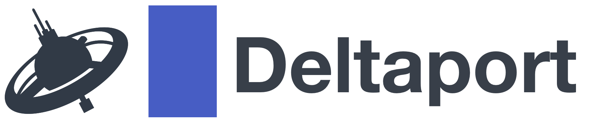

<div align="center">
  <br/>
  
  <br/>
  <br/>
  <p>
    DeltaPort.io is open source, self hosted, multi exchange <br>
    and crypto native trading platform.
  </p>
  <br/>
  <p>
    <a href="https://deltaport.io"><strong>Homepage</strong></a> ·
    <a href="#demo"><strong>Demo</strong></a> ·
    <a href="#downloads"><strong>Downloads</strong></a> ·
    <a href="#quickstart"><strong>Quickstart</strong></a> ·
    <a href="#dev"><strong>Dev</strong></a> ·
    <a href="#documentation"><strong>Documentation</strong></a>
  </p>
  <br/>
  <br/>
</div>

# Demo

Demo web app can be found [here](https://demo.deltaport.io).

Login with `demo@deltaport.io` for email and `demo` for password.

# Downloads

Check [website](https://deltaport.io) or [releases](https://github.com/Deltaport-io/deltaport/releases).

# Quickstart

- Clone this repo: 
  ```sh
  git clone https://github.com/deltaport-io/deltaport
  ```
- Enter cloned repo:
  ```sh
  cd deltaport
  ```
- Start everything with docker:
  ```sh
  docker compose up
  ```
- Open client in browser:
  ```sh
  http://127.0.0.1:3000
  ```

# Dev

- Clone this repo: 
  ```sh
  git clone https://github.com/deltaport-io/deltaport
  ```
- Start mysql and redis from `deltaport` in first terminal:
  ```sh
  docker compose up mysql redis
  ```
- Setup and start server from `deltaport/server` in second terminal:
  ```sh
  npm install
  npm run start-watch
  ```
- Setup and start client from `deltaport/client` in third terminal:
  ```sh
  npm install
  npm run start
  ```
- Open client in browser:
  ```sh
  http://127.0.0.1:3000
  ```

# Documentation

Documentation of Bot and REST APIs can be found here LINK

# License

DeltaPort.io is dual-licensed:

* [AGPLv3](https://opensource.org/licenses/AGPL-3.0) for open source use.

* Commercial license for use in non-GPL setting. Contact us at contact@deltaport.io for details.
