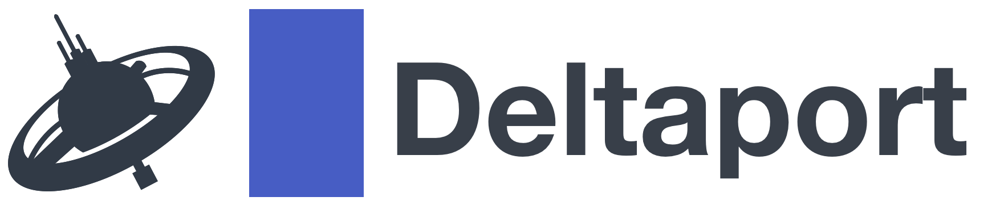
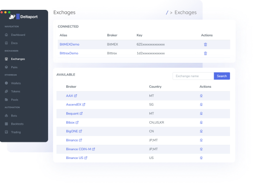
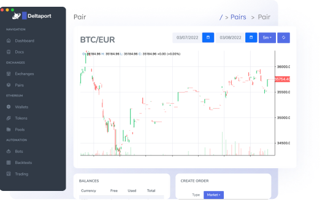
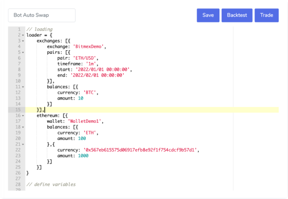

<div align="center">
  <br/>
  
  <br/>
  <br/>
  <p>
    DeltaPort.io is open source, self hosted<br>
    Crypto, DeFi, GameFi automation platform.
  </p>
  <br/>
  <p>
    <a href="https://deltaport.io"><strong>Homepage</strong></a> ·
    <a href="https://demo.deltaport.io/login?ssid=1823375daa7.5MhliuKvWyFIrseSdIjJtyuJMEYecpJLn6LnQ4dn9VfAGd3oEeXbUpG/2np53d4d" target="_blank"><strong>Demo</strong></a> ·
    <a href="#features"><strong>Features</strong></a> ·
    <a href="#download"><strong>Download</strong></a> ·
    <a href="#documentation"><strong>Documentation</strong></a> ·
    <a href="#quickstart"><strong>Quickstart</strong></a> ·
    <a href="#dev"><strong>Dev</strong></a> ·
  </p>
  <br/>

  
  
  
  
  <br/>
</div>

# Features
<div style="padding-bottom: 30px; text-align: center;">
  
  <div style="width: 200px; margin: 0 auto;">Connect your crypto wallets and exchanges!</div>
</div>
<div style="padding-bottom: 30px; text-align: center;">
  
  <div style="width: 200px; margin: 0 auto;">Trade, transfer, swap tokens and pairs from app!</div>
</div>
<div style="padding-bottom: 30px; text-align: center;">
  
  <div style="width: 200px; margin: 0 auto;">Use sandbox to code your tradings automations!</div>
</div>

# Download

Downloads can be found on [website](https://deltaport.io) or in github [releases](https://github.com/Deltaport-io/deltaport/releases).

# Documentation

Documentation of Bot sandbox and REST APIs can be found [here](https://github.com/Deltaport-io/deltaport/blob/main/client/src/Main.md)

# Quickstart

- Clone this repo: 
  ```sh
  git clone https://github.com/deltaport-io/deltaport
  ```
- Enter cloned repo:
  ```sh
  cd deltaport
  ```
- Start everything with docker:
  ```sh
  docker compose up
  ```
- Open client in browser:
  ```sh
  http://127.0.0.1:3000
  ```

# Dev start

- Clone this repo: 
  ```sh
  git clone https://github.com/deltaport-io/deltaport
  ```
- Start mysql and redis from `deltaport` in first terminal:
  ```sh
  docker compose up mysql redis
  ```
- Setup and start server from `deltaport/server` in second terminal:
  ```sh
  npm install
  npm run start-watch
  ```
- Setup and start client from `deltaport/client` in third terminal:
  ```sh
  npm install
  npm run start
  ```
- Open client in browser:
  ```sh
  http://127.0.0.1:3000
  ```

# License

DeltaPort.io is dual-licensed:

* [AGPLv3](https://opensource.org/licenses/AGPL-3.0) for open source use.

* Commercial license for use in non-GPL setting. Contact us at contact@deltaport.io for details.
